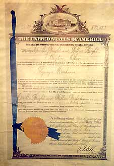
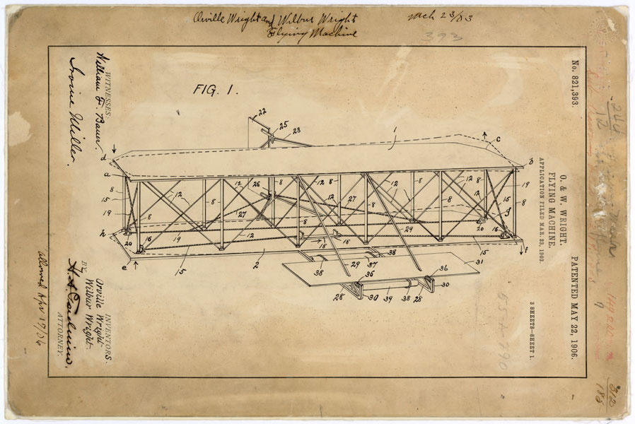

Wright Brothers’ Patent

In 2000 the National Archives were setting up for a turn of the century
exhibit and went to pull what could arguably be considered one of the
nation’s most important historical documents, to discover it missing
(Lewis). It turns out that the last time that the patent for the Wright
Brother’s “Flying Machine” was last seen after an exhibit in 1979 to
celebrate the 75^th^ year anniversary of the filing of the patent, and
the anniversary of the creation of flight as we know it. (“National
Archives Honors Wright Brothers with Upcoming Special Display”).

The Wright Brothers filed their patent in March 1903, and were able to
make the first man made flight in Kitty Hawk, North Carolina in December
1903. They were officially issued patent number 821.393 in May 1906,
forever changing the face of modern travel. After being found missing in
2000 the patent was presumed misplaced or stolen, since the National
Archives has a long history of thieves pilfering some of America’s most
precious artifacts (Ferriero), as well as over 269 millions patents
stored, wherein one folder could easily be misplaced.

A team of recovery agents launched a targeted search to recover
alienated and stolen archival materials, and were able to recover the
missing patent and subsequent documents in a limestone storage cave in
Kansas in March 2016(Lewis, National Archives Honors Wright Brothers
with Upcoming Special Display). There are 18 of these storage facilities
that are currently holding the 107,600 cubic feet of patents (Namowitz).
The National Archives will be displaying the recovered patent staring
May 20^th^ of this year to commemorate the 110^th^ anniversary of
issuing the patent for the “Flying Machine” and it will be displayed in
the National Archive Museums’ West Rotunda Gallery.

“We had to ask ourselves, ‘Is this something that could have been
stolen?’, noted the Chief Operating Office of the National Archives,
William J. Bonsanko while speaking to the Washington Post (Ruane). This
presents a question of ethics with archivists, one that looks as though
is consistently an issue within our society (Ferriero). It seems that
there is quite a history of theft within our National Archives and with
other archives around the country as there have been several individuals
obtaining long prison sentences for stealing some of the more valuable
materials in recent years (Ferriero).

The Archives have attempted to prevent more documents from being stolen
by increasing surveillance programs in the reading rooms, and instituted
check of bags when researchers and staff leave the building (Ferriero).
They are doing what they can to keep people, such as Barry Landau, who
had his jackets tailored with pockets large enough to take large sized
documents, from stealing some of our nation’s most prized possessions
(CBSNewsOnline.). Barry would say he was a Presidential Archivist
(although there is nothing saying he was an archivist at all) and was
notorious for charming over archivists and historians with snacks and
cupcakes while he would steal and sell archival documents
(CBSNewsOnline.)

The National Archives does have a code of ethics, known as the
Archivist’s Code, which archivists are expected to abide by. It states
that:

> The Archivist has a moral obligation to society to take every possible
> measure to ensure the preservation of valuable records, not only those
> of the past but those of his own time and of equal zeal (“The
> Archivist’s Code).

Even given this code of ethics, it seems that there is a problem with
stealing, with archivists and patrons, and it seems that a call for
respect of the materials is needed on all sides to be able to help
protect our nation’s treasures.

William Bonsanko also stated “If someone puts something back in the
wrong place, it’s essentially lost.” The fact that the National Archives
has so many files to keep up with it’s not hard to understand how things
can get misplaced and it seems to be an ongoing issue within the
archival world (Ruane). Even though it isn’t hard to understand how
things go missing, it still is very upsetting to me that we are failing
to properly arrange our documents so that they are easily found and
cared for.

The Wright Brothers’ Patent, although not where it was supposed to be,
was in a decent condition for a 100-year-old document (Ruane). But there
are many documents that require special attention, or preservation, that
if misplaced will not get the care that they so desperately deserve. The
National Archives having so many documents to care for reminds me of the
American Heritage Center, who had so many things to care for, that they
had to deaccession a large part of their archives to ensure that they
could care for the documents they had (Jackson, Laura, and D. Thompson).
I do not want to suggest that any of the documents in the National
Archive’s possession aren’t important enough, or shouldn’t be housed
with the National Archives, because that is probably the best place for
most of the documents within their holdings. However, it does seem to me
that the National Archives is in need of staff and funding to be able to
account for and properly care for the documents in their possession. The
targeted searches are evidence that they are attempting to increase
their numbers in order to find some of these misplaced files, and maybe
the discovery of the Wright Brother’s Patent, directly after two extra
staff were hired for the purpose of the Archival Recovery Program, will
bring more needed attention to this area.

In addition to sending out recovery teams for targeted searches to
recover misplaced and stolen items, the National Archives is also
reaching out to the public, and those who deal in historical documents,
as well those who work at libraries, archives and museums asking them to
avoid buying or selling lost or stolen goods and reporting any
identified goods to the National Archives ("Help the National Archives
Recover Lost and Stolen Documents.") The National Archives has a listing
showing all of the missing historical documents that you can help
recover, ranging from Civil War Documents to missing Presidential Items.
(“Missing Documents from the National Archives).

While I am personally ecstatic that the missing Wright Brother’s Patent
was found, it does raise some serious questions in my mind about
archives. How can we gain more security to aid against those would
pilfer our country’s historical documents? How can we ensure those who
go into the field of archives are ethical, and want to preserve these
documents instead of taking them for their own accord? How can we enact
a better filing system for an archive containing billions of pieces of
paper? As archivists we have a moral obligation to “ensure the
preservation of valuable records”, and it appears that that statement is
two-fold in that we must ensure the preservation of records by
preventing them from being stolen, and ensuring their preservation by
filing and ordering them properly.

**Works Cited**

"The Archivist's Code." National Archives and Records Administration.
National Archives and Records Administration, n.d. Web. 08 Oct. 2016.

<http://www.archives.gov/preservation/professionals/archivist-code.html>

CBSNewsOnline. "National Archives' Treasures Targeted by Thieves."
YouTube. YouTube, 2012. Web. 08 Oct. 2016.

> <https://www.youtube.com/watch?v=EJ9D0kfRYW0>

Ferriero, David S. "Tracking Down Missing Titles." National Archives.
N.p., 2016. Web.

<https://www.archives.gov/publications/prologue/2016/summer/archivist.html>

"Help the National Archives Recover Lost and Stolen Documents." National
Archives and Records Administration. National Archives and Records
Administration, n.d. Web. 08 Oct. 2016.

<http://www.archives.gov/research/recover/>

Jackson, Laura, and D. Thompson. "But You Promised: A Case Study of
Deaccessioning at the American Heritage Center, University of Wyoming."
The American Archivist 73.2 (2010): 669-85. Web.

<http://americanarchivist.org/doi/pdf/10.17723/aarc.73.2.297691q50gkk84j4>

Lewis, Danny. "After 36 Years, Archivists Finally Found the Wright
Brothers' Airplane Patent." Smithsonian Magazine. Smithsonian, n.d. Web.
08 Oct. 2016.

<http://www.smithsonianmag.com/smart-news/after-36-years-archivists-finally-found-wright-brothers-airplane-patent-180958649/?no-ist>

"Lost Plans for Wright Brothers' 'Flying Machine' Found after 36 Years."
Washington Post. The Washington Post, n.d. Web. 08 Oct. 2016.

[
https://www.washingtonpost.com/local/lost-plans-for-wright-brothers-flying-machine-found-after-36-years/2016/04/02/e526fd56-f6b2-11e5-9804-537defcc3cf6\_story.html?tid=sm\_tw](https://www.washingtonpost.com/local/lost-plans-for-wright-brothers-flying-machine-found-after-36-years/2016/04/02/e526fd56-f6b2-11e5-9804-537defcc3cf6_story.html?tid=sm_tw)

"Missing Documents from the National Archives." National Archives and
Records Administration. National Archives and Records Administration,
n.d. Web. 08 Oct. 2016.

[*http://www.archives.gov/research/recover/*](http://www.archives.gov/research/recover/)

Namowitz, Dan. "Missing Wright Brothers' Patent File Found." - AOPA.
N.p., n.d. Web. 08 Oct. 2016.

<https://www.aopa.org/news-and-media/all-news/2016/april/06/missing-wright-brothers-patent-file-found-will-be-displayed>

"National Archives Honors Wright Brothers with Upcoming Special
Display." National Archives and Records Administration. National
Archives and Records Administration, n.d. Web. 08 Oct. 2016.

<http://www.archives.gov/press/press-releases/2016/nr16-52.html>
